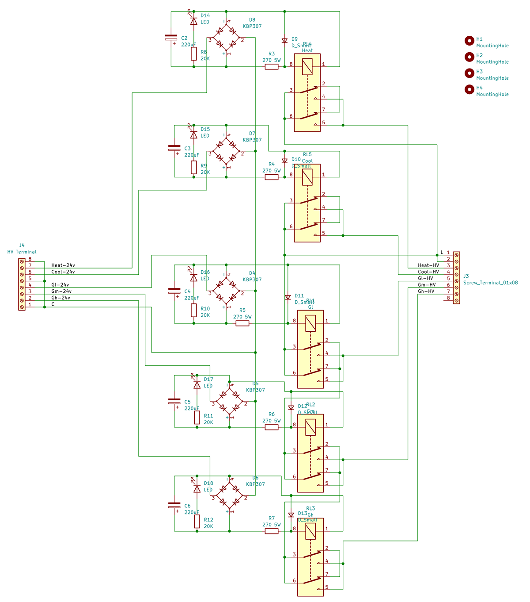

# Schematic

The Thermostat Relay Board (the Thermostat Board) has up to 5 relay channels using AC-DC conversion.
Because 24V AC gives about 34V DC after rectified, there is a resistor to bring the voltage within the specs of the relays.
Each channel has an LED indicator for easier debugging.

