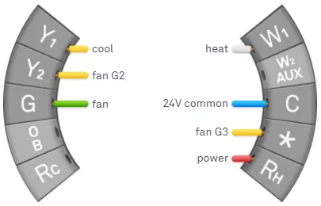

# Usage

## General introduction
The Thermostat Relay Board (the Thermostat Board) bridges line voltage heating/cooling system and low voltage thermostats which can be used with 24 VAC systems.
Source repository: https://github.com/nochkin/thermostat-relay

Compatible low voltage smart thermostats are, but not limited to:
* Ecobee (all generations).
* Google Nest (all generations). In case of using 3-stage fan, it's required for Nest Learning thermostat as it has additional connections for it.
* Other WiFi-based low voltage smart thermostats.

Compatible line voltage cooling/heating systems are those which are controlled by line voltage which can be 120V AC or 240V AC.

The fully populated board is capable of controlling Cooling, Heating and 3-stage Fan. But the board can be built using some of the features depending on the requirements.

## Board layout
The Thermostat Board consists of two logical parts:
* Low voltage. This side takes control signals from the connected low voltage thermostat and sends control signals to correspondent relays.
* High voltage. This side controls high voltage lines of the existing heating/cooling system or/and fan depending on the configuration.

## Connection
> [!CAUTION]
> There is a high voltage which can be dangerous when not handled properly. Make sure you know what you are doing when working with a high line voltage.

The schematic diagram using Nest thermostat as example is shown below:

## Nest wiring
In order to able to use 3-stage fan, the setup should have Nest Learning thermostat. During the initial configuration, it must be done using the Pro Setup to configure additional connections for the fan.
The final configuration should look like this:

| Connection | Function |
| --- | --- |
| Y1 | Cool |
| W1 | Heat |
| G | Regular fan (low speed) |
| Y2 | Fan G2 (medium speed) |
| * | Fan G3 (high speed) |
| Rh | 24V AC (Power) |
| C | 24V AC (Common) |
